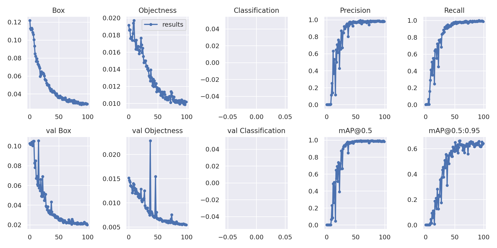

# Pipeline of situation recognition

By Anni Johansson, Chanon Borgström and Robert Lupeskovic

This document describes our process of discovering completed cities on a Carcassonne game board using object detection.

## Creating board images

Using the ToString method inside of TileState.cs created by David, we are able to print out a matrix the size of 40x40, as well as bounding boxes of the completed cities using a function that exists in the City class. With further development we should be able to only print a matrix of placed tiles which will make the board/matrix a lot smaller. These matrix representations are written to a text file that is then later read in python converting the different Enum to grayscale values (0-255). The bounding box is written to a json object containing the x and y coordinates and the width and height which is then written to a file.. 

## Creating the dataset

When we first wanted to start training models we were not finished with the code for printing the annotation for the bounding boxes in Unity. Instead, once we had created the images representing the board, we used [Roboflow](https://roboflow.com/) to create annotations for the completed cities in the images. We followed [this tutorial](https://blog.roboflow.com/getting-started-with-roboflow/). Roboflow can help you create datasets with images and annotation files in several formats like COCO, YOLO etc.

## Training the model

We have been using [Roboflows Colab notebooks](https://models.roboflow.com/) in order to train our models. We decided to use YOLOv5x since it is an accurate but also fast way to do object detection.

In this Github folder there is a zip file of our latest and biggest dataset, the latest trained model (best.pt), the model exported to the ONNX-format (best.onnx), the [Roboflow YOLOv5 Colab notebook](https://colab.research.google.com/drive/1oKnxaYo5ppRMFurHB-kdzS7T1k43EqBv?usp=sharing) used for training and a set of instructions on how to train the model using your own dataset. 

## Results

Training a model with YOLOv5x and our latest dataset of 743 images in total gave the following results.

>>>>>  gd2md-html alert: inline image link here (to images/image1.png). Store image on your image server and adjust path/filename/extension if necessary.  (<a href="#">Back to top</a>)(<a href="#gdcalert2">Next alert</a>) >>>>> 

>>>>>  gd2md-html alert: inline image link here (to images/image2.png). Store image on your image server and adjust path/filename/extension if necessary.  (<a href="#">Back to top</a>)(<a href="#gdcalert3">Next alert</a>) >>>>> 

Here is some of the the labeled data:

>>>>>  gd2md-html alert: inline image link here (to images/image3.jpg). Store image on your image server and adjust path/filename/extension if necessary.  (<a href="#">Back to top</a>)(<a href="#gdcalert4">Next alert</a>) >>>>> 

And here are the predictions made by the trained model for those images:

>>>>>  gd2md-html alert: inline image link here (to images/image4.jpg). Store image on your image server and adjust path/filename/extension if necessary.  (<a href="#">Back to top</a>)(<a href="#gdcalert5">Next alert</a>) >>>>> 

The predictions have become more accurate the more images we have added to the dataset. An even bigger dataset with more variations in city forms is probably needed to make the model better at finding bigger and more complex cities.

## 

## Adding the trained model to Unity

Early on in our research we looked into [ML-agents](https://github.com/Unity-Technologies/ml-agents) and [Unitys perception package](https://github.com/Unity-Technologies/com.unity.perception). ML-agents [is better used for AI:s that are trained using reinforcement learning](https://www.youtube.com/watch?v=jPq3b0RSRU8) and was therefore not suitable for our task. The same goes for Unitys perception package which puts labels on game objects. Since we wanted to look at parts of several game objects (tiles), this was not suitable either.

So what we decided to do was to train the model outside of Unity and then use [Barracuda](https://docs.unity.cn/Packages/com.unity.barracuda@1.2/manual/GettingStarted.html), according to [this source](https://medium.com/@a.abelhopereira/how-to-use-pytorch-models-in-unity-aa1e964d3374), to add our model to the Unity project. We [exported the trained weights to the ONNX-format](https://github.com/ultralytics/yolov5/issues/251) in order to use it in Unity with [Barracuda](https://docs.unity.cn/Packages/com.unity.barracuda@1.2/manual/GettingStarted.html). We followed [this tutorial](https://www.youtube.com/watch?v=ggmArUbRvC4) but got the following error message when executing the model:

>>>>>  gd2md-html alert: inline image link here (to images/image5.png). Store image on your image server and adjust path/filename/extension if necessary.  (<a href="#">Back to top</a>)(<a href="#gdcalert6">Next alert</a>) >>>>> 

We did not manage to understand or solve this problem and we do not know if this is because the YOLOv5 architecture format [is not supported by Barracuda](https://docs.unity.cn/Packages/com.unity.barracuda@1.2/manual/SupportedArchitectures.html) or if there is a problem with the model itself. A next step could be to train a model using e.g. Tiny YOLO v2 and see if that model works with Barracuda.
