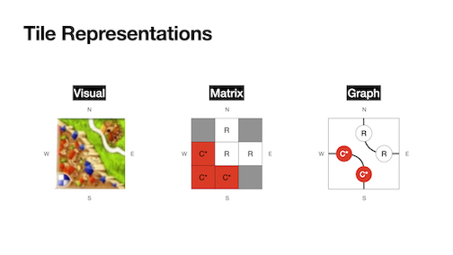
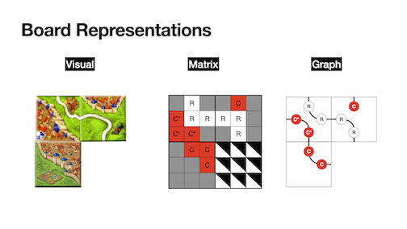

# Overview

A proposed comprehensive game state is defined in this document as well as a proposed action representation. Actions cause state changes and the game should be able to be defined by an initial state and a set of actions, though this may not be true for portions (especially the physiological portions) of the player states.

The state of the game is divided into categories: Rules, Game, and Player.
Carcassonne can be played with different rule sets, so it is important to define here which rules and modifications are being used.
In the current implementation of the game, the rules are fixed, but this is included for future developments and to specify which rules are being used currently.

The state variables are further tagged as Intrinsic, *Derived*, **Measured**, ***Inaccessible*** using italics and bold font.
Intrinsic state variables come directly from the game pieces, holding information like the location of tiles, etc.
*Derived* state variables can be calculated from Intrinsic ones, such as the number of tiles remaining, which can be found using the set of tiles on the board.
**Measured** state variables are primarily player-related physiological states that we can measure using the equipment being used.
And ***Inaccessible*** are player-related states that are not immediately available and must be learned/estimated or require additional equipment (but could be interesting and relevant for assessing their gameplay).

I should note that this draws heavily on the framework at <https://wingedsheep.com/programming-carcassonne/>.

## Board Representations
There are two possible representations (that I've come up with...I'm sure there are more!) for the positions of the tiles on the board.
Each has its advantages and disadvantages and we might end up wanting to move between them.

Tiles and the entire board can be represented as a matrix of features.
Each tile is a 3x3 matrix and each feature is one of **R**oad, **C**ity, or **Ch**apel (we ignore Fields and Rivers for now because they are not being used in this rule set).

The alternative representation is as a graph of features with ports on the **N**orth, **S**outh, **E**ast, and **W**est of each tile (these cardinal directions are fixed for a tile and if the tile is rotated, **N** might face down or to the side).

These two representations expand from the tile into the whole board, creating a board-wide matrix of roads and cities, or a board-wide graph of the same.

## Useful Data
### Tiles
There are 48 land tiles and 12 river tiles (if they are being used). 

* 48 land
* 12 river (should not used here, but they do currently appear in the game)

### Meeples

* Colours: yellow, red, green, blue, black
* 7 + abbot (-1 for scoreboard)
* Roles: highwayperson, knight, monk, farmer?

# State
## Rules
* abbots (`bool`: `False`)
* river (`bool`: `False`)
	* *This is currently implemented incorrectly. River tiles are mixed in with the main game tiles, but they should be placed at the beginning of the game if they are being used.*
* farmers (`bool`: `False`)

## Game

* phase {`GameControllerScript.phase`} (`enum: [tile, meeple, scoring]`)
* remaining tiles {`StackScript`} (`list`)
* current tile (`obj`)
* *allowed tile placements* (`list`)
* *allowed meeple placements* (`list`)
* players (`list`)
* current player (`obj`)
* played tiles {`PlacedTileScript`} (`matrix`)
	* *we could also use a graph representation here, which might be more effective.*
* *cities*
	* complete (`bool`)
	* segments (`int`)
	* shields (`int`)
	* meeples (`list`)
	* open sides (`int`)
	* completable (`bool`)
		* *calculated from the remaining game tiles*
* *roads*
	* complete (`bool`)
	* segments (`int`)
	* meeples (`list`)
	* open sides (`int`)
	* completable (`bool`)
		* *calculated from the remaining game tiles*
* *chapels*
	* complete (`bool`)
	* segments (`int`)
	* meeples (`list`)
	* completable (`bool`)
		* *calculated from the remaining game tiles*

### Tile

* set (`enum`: `[main, river, ...]`)
* shield (`bool`)
* layout (`matrix`)
	* *we could also use a graph representation here, which might be more effective.*
* meeple (`obj`)
* meeple position (`enum`: `[N,S,E,W,C]`)

### Meeple

* set (`enum`: `[main, abbot]`)
* player (`obj`)
* *colour*
* *placement*

## Player

* score (`int`)
* *score including unfinished* (`int`)
* *remaining meeples* (`int`)

* ***priorities/focus/short-term goals***
* ***play style/strategy preference***
* ***expertise/experience***

### Physiology
* **alertness**
* **distraction**
* **attention/saliency map**
* ***emotional valence***
* ***emotional arousal***
* ***heartrate***
* ***EEG data*** (for example from <https://www.emotiv.com/>)

# Actions

* Tile placement (`matrix`)
	* *in graph representation: new connection point*
* Meeple placement (`enum`: `[N,S,E,W,C]`)